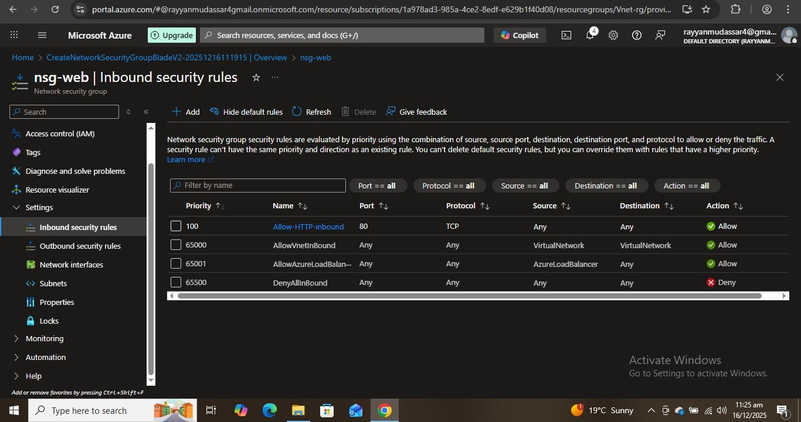

# Day 1
I learned about Entra-ID and role assignments, the most important thing is to assign the roles directly to groups, I created a user and then I created a group, I added the user into the group and then assigned the reader role to the group, then I tried to create a resoruce through the user account and got this error:

To solve this error I went back to my orignal account where I am the owner and assigned the Contributor role to the group, the roles inherited to the user and again I tried to create a resource and then it was successful:

## Learnings from Day 1
I learnt that we should always use groups to assign roles to users, because it is much easier to manage and we can keep track, if we assign directly to users, this would become messy.
# Day 2
My objective was to create a vnet with subnets and control inbound and outbound network traffic by using NSGs and making the network secure. Firstly I created a VNet with 2 subnets in it, then I created a network security group and added an inbound rule to allow access only to port 80 (HTTP):

 After this rule creation, I had to implement this rule to subnet level, I associated these rules with my subnet-web:
 
## Learnings from Day 2
I learnt why we make subnets and use NSGs and how to make our network secure. We should always create rules for inbound traffic to allow the desired IP or desired port traffic. This ensures our system safety. Firewalls can also be used on higher levels.
