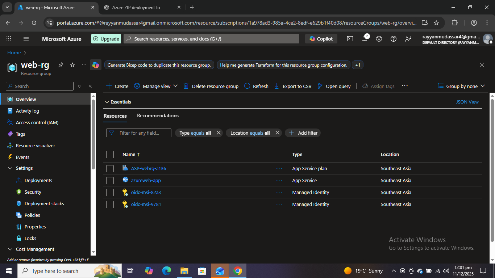
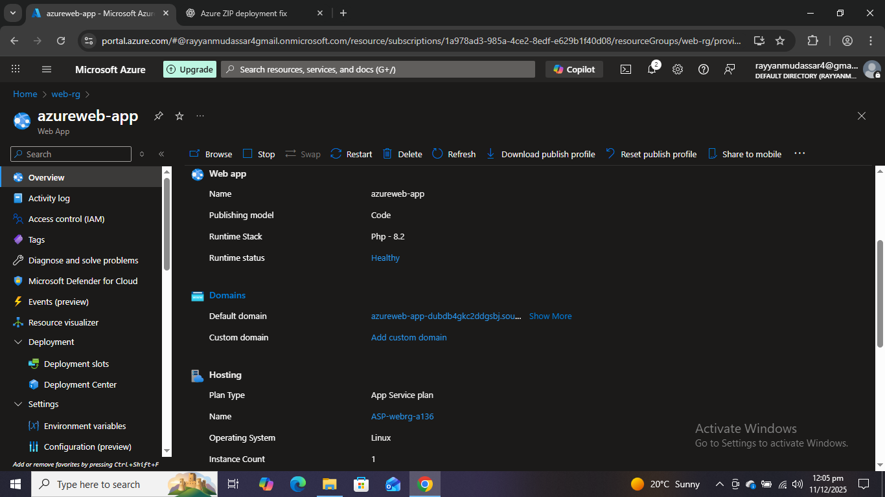
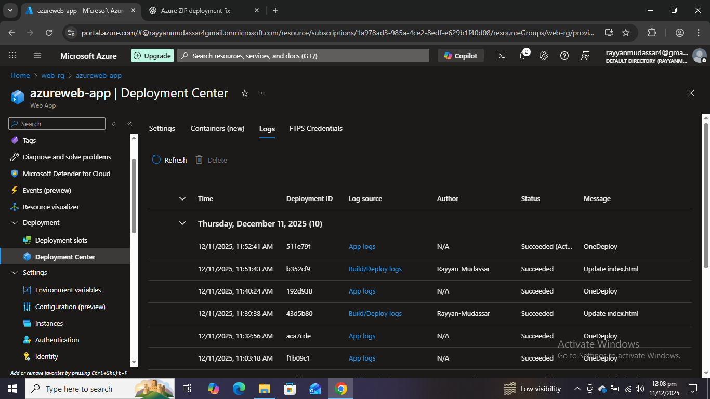

# Azure App Service Deployment with GitHub CI/CD

## Overview
Hey! This project shows how I deployed a web app on **Azure App Service (Linux, PHP 8.2)** and connected it to **GitHub for CI/CD**.  
Initially, I tested deployment using a ZIP file, but later I removed it and fully switched to GitHub integration. Now, any updates I push to GitHub automatically reflect on my live site. 

[Link to the webpage](https://azureweb-app-dubdb4gkc2ddgsbj.southeastasia-01.azurewebsites.net)

---

## Technologies Used
- **Azure App Service** (Linux, PHP 8.2)  
- **GitHub** (CI/CD)  
- **SSH Terminal**  
- **HTML / PHP / Basic web files**  

---

## Screenshots

1. **Resource Group**
   

3. **App Service Overview**
   
   
5. **App Service Plan (PHP 8.2 Linux)**
   
   
6. **SSH Terminal showing GitHub deployment**
   
   
7. **Deployment Center GitHub Integration**
    
   
9. **Deployment Logs**
  

10. **Website Running Live**
   

11. **GitHub Repository**
  
---

## Steps Performed

1. **Created Resource Group**  
   Set up a new resource group in Azure to keep everything organized.

2. **Created Linux App Service**  
   Deployed a **PHP 8.2 Linux App Service** in Azure under the free tier.

3. **Initial ZIP Deployment**  
   Uploaded a ZIP file of my project to test deployment (it worked).  

4. **Removed ZIP Deployment**  
   Opened SSH → navigated to `/home/site/wwwroot` → deleted the ZIP deployment to prevent conflicts with GitHub CI/CD.

5. **Integrated with GitHub**  
   Connected the App Service to my GitHub repository via **Deployment Center**.

6. **Triggered Deployment Sync**  
   Refreshed & synced GitHub deployment. After a few seconds, my live website updated.

7. **Verified Deployment**  
   - Checked SSH → README.md and code files were present  
   - Opened the website → it displayed the latest content from GitHub  

---

## Troubleshooting

- On Linux, Azure hides **Debug Console (Kudu)**, so you can’t delete ZIP via UI.  
- ZIP deployment overrides GitHub CI/CD, so removing it via SSH is required.  
- Free tier / trial subscription hides some configuration options, but SSH + Deployment Center works perfectly.

---

## Lessons Learned

- Always check the deployment method — ZIP deployment can block GitHub updates.  
- On Linux App Service, SSH is your friend.  
- Free Azure subscriptions have limitations, but they are enough for portfolio projects.  
- CI/CD via GitHub makes deployment easy and repeatable.

---

## How to Reproduce This Project

1. Create a Resource Group in Azure.  
2. Deploy a Linux App Service (PHP 8.2).  
3. Upload a test ZIP file if you want to check initial deployment.  
4. Open SSH → delete ZIP deployment files from `/home/site/wwwroot`.  
5. Connect your GitHub repo via Deployment Center.  
6. Trigger Sync / Redeploy → your website updates automatically.  
7. Verify deployment via SSH and browser.

---

*Project done by Rayyan Mudassar – Azure App Service & GitHub CI/CD*

