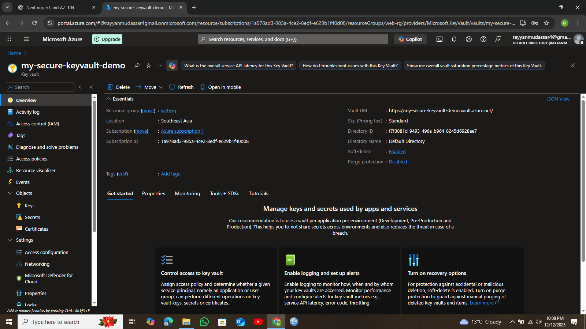

#  Azure Key Vault + App Service (Secure Secrets Project)

##  Project Overview

This project demonstrates **secure secret management in Azure** by integrating **Azure Key Vault** with **Azure App Service** using **Managed Identity**.

Instead of hardcoding secrets (like database passwords or API keys) inside the application code, the app securely fetches them from **Azure Key Vault** at runtime.

This is a **real-world cloud security pattern** used by companies to protect sensitive information.

---

##  What Problem This Project Solves

❌ Secrets stored in code or config files can be leaked
❌ Rotating secrets becomes risky and manual
❌ Developers shouldn’t have direct access to production secrets

✅ Azure Key Vault centralizes secrets
✅ Managed Identity removes the need for credentials
✅ Secure, auditable, and scalable solution

---

##  Architecture Used

User → Azure App Service → Managed Identity → Azure Key Vault → Secret Value

**Key Components:**

* Azure App Service (Linux, PHP)
* Azure Key Vault
* System Assigned Managed Identity
* Access Policies / RBAC

---

##  Services Used

* **Azure Resource Group** – Logical container
* **Azure App Service** – Hosts the web application
* **Azure Key Vault** – Stores secrets securely
* **Managed Identity** – Secure authentication between services

---

##  Implementation Steps

### 1️⃣ Create Resource Group

Created a new resource group to organize all services.

---

### 2️⃣ Create Azure Key Vault

* Created a Key Vault
* Added a secret (`Mysterious#1`)

---

### 3️⃣ Create Azure App Service

* Runtime: PHP 8.2 (Linux)
* Deployment using ZIP / GitHub

---

### 4️⃣ Enable Managed Identity

* Enabled **System Assigned Managed Identity** on App Service
* This identity is automatically managed by Azure

---

### 5️⃣ Grant Key Vault Access

* Assigned **Get** and **List** permissions for secrets
* Allowed the App Service identity to access Key Vault

---

### 6️⃣ Access Secret from App

The application retrieves secrets securely from Key Vault instead of storing them locally.

---

##  Why App Service Was Connected to Key Vault 

App Service was used because:

* It supports **Managed Identity** natively
* It can securely authenticate without usernames or passwords
* It is commonly used in real-world production environments

Other resources *could* connect, but App Service is ideal for:

* Web apps
* APIs
* Microservices

---

##  Real-World Use Case

* Storing database credentials
* Protecting API keys
* Secure configuration for production apps
* Compliance-ready cloud architecture

This pattern is used by **banks, SaaS companies, and enterprises**.

---

##  Screenshots

Below are screenshots added using **pure Markdown syntax**.

### Key Vault Secret

```md

```



### Managed Identity Enabled

```md

```


### Key Vault Access Policy

```md

```


### Application Output

```md

```


---

## What I Learned

* How Azure Key Vault works in real production
* Why Managed Identity is more secure than credentials
* Secure cloud design patterns
* How services authenticate without secrets

---

## Author

**Rayyan Mudassar**

---

## Final Notes

This project focuses on **security-first cloud design**, not just deployment.
It proves hands-on understanding of **Azure security fundamentals**.

---

