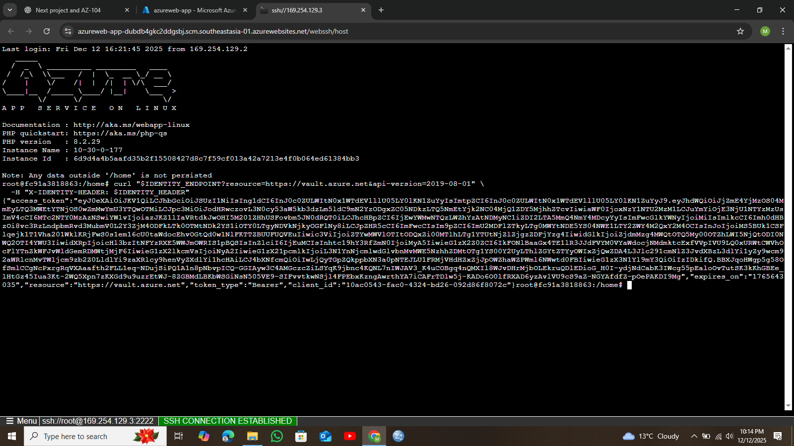
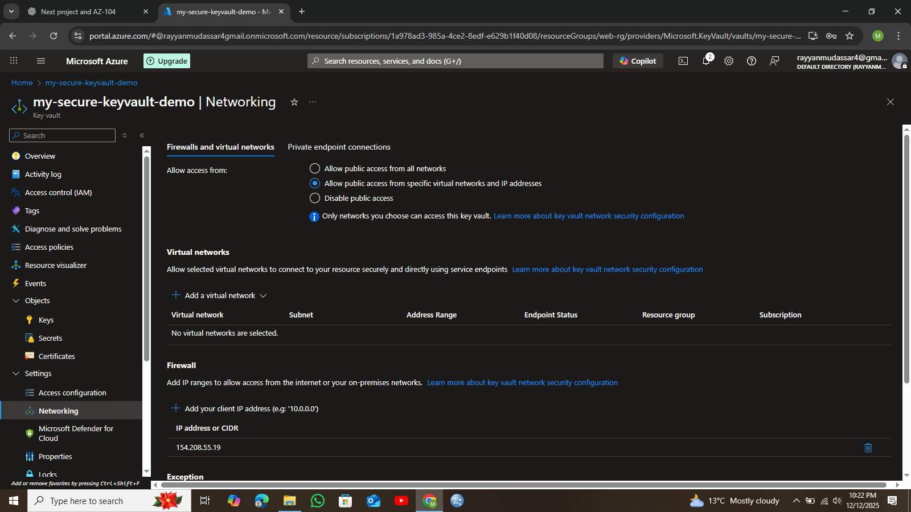

#  Azure Key Vault + App Service (GitHub Integrated Project)

##  Project Overview

This project demonstrates how I securely connected an **Azure App Service** (deployed via **GitHub integration**) with **Azure Key Vault** using **System Assigned Managed Identity**.

The goal was to **securely store and retrieve secrets** without hardcoding them in the application or GitHub repository, following **real-world cloud security practices**.

---

##  How This Project Was Built (My Actual Flow)

I built this project step by step while deploying a live web app and securing it using Azure-native security features.

This README reflects **exactly how I implemented it**, including issues I faced and how they were resolved.

---

##  Architecture

User → Azure App Service (GitHub Deployed)
→ Managed Identity
→ Azure Key Vault
→ Secret Retrieved Securely

---

##  Azure Services Used

* **Azure App Service (Linux)** – Web application
* **GitHub** – Source control & deployment
* **Azure Key Vault** – Secure secret storage
* **Managed Identity** – Passwordless authentication
* **Azure Monitor / Log Analytics** – Diagnostics

---

##  Implementation Steps (As I Did Them)

### 1️⃣ Azure Key Vault Created

I first created an Azure Key Vault to act as a centralized and secure place for storing secrets.

```md

```


---

### 2️⃣ Secret Added to Key Vault

I added a secret inside the Key Vault. This secret represents sensitive data that should never be stored in code or GitHub.

```md

```


---

### 3️⃣ App Service with GitHub Integration

I already had an Azure App Service deployed and connected to **GitHub**, so every change pushed to GitHub automatically updated the web app.

This ensured real-world CI-style deployment while keeping secrets out of the repository.

---

### 4️⃣ Managed Identity Enabled on App Service

I enabled **System Assigned Managed Identity** on the App Service so Azure could handle authentication securely without credentials.

```md

```


---

### 5️⃣ Key Vault Access Policy Assigned

I granted the App Service’s Managed Identity permission to **Get** secrets from Key Vault.

```md

```


---

### 6️⃣ Access Token Issue & Debugging

While testing access, I faced issues related to **access tokens**. This helped me understand how Managed Identity requests tokens internally and why correct permissions are required.

```md

```



---

### 7️⃣ Secret Successfully Retrieved in App

After fixing permissions and identity access, the application successfully retrieved the secret from Key Vault and displayed the output.

```md

```


---

### 8️⃣ Firewall & Network Configuration

I reviewed Key Vault firewall settings to understand **public vs private access** and how network restrictions affect service communication.

```md

```



---

### 9️⃣ Diagnostic Logs Enabled

Finally, I enabled **diagnostic logs** and sent them to **Azure Log Analytics Workspace** to monitor access and troubleshoot issues.

```md

```


---

##  Why This Design Is Secure

* No secrets stored in GitHub
* No credentials inside application code
* Managed Identity handles authentication
* Access controlled via Azure policies
* Logging enabled for monitoring and auditing

---

##  What I Learned

* Real-world usage of Azure Key Vault
* How Managed Identity works internally
* Debugging access token issues
* Importance of firewall and network security
* Monitoring using Azure diagnostics

---

##  Author

**Rayyan Mudassar**

---

##  Final Notes

This project reflects **hands-on Azure security implementation**, not just theory.
It demonstrates how production applications securely manage secrets using Azure-native services.

