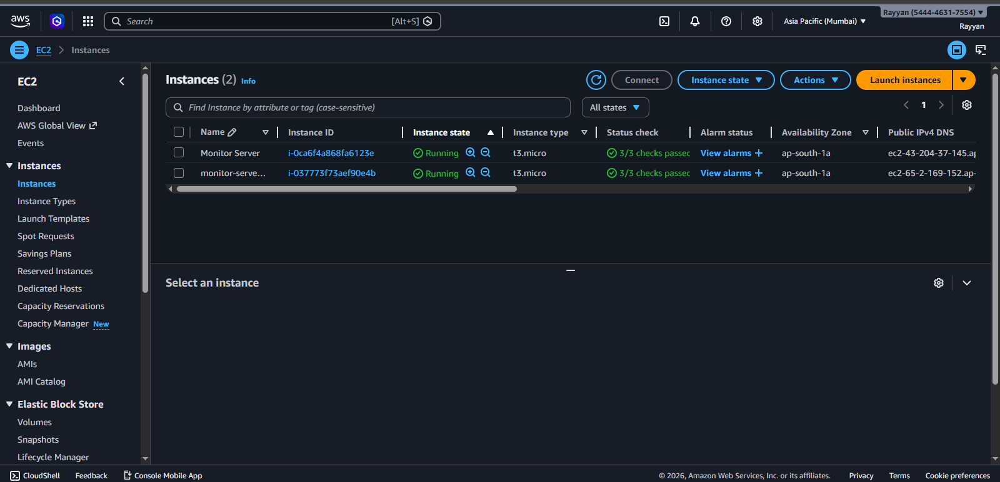
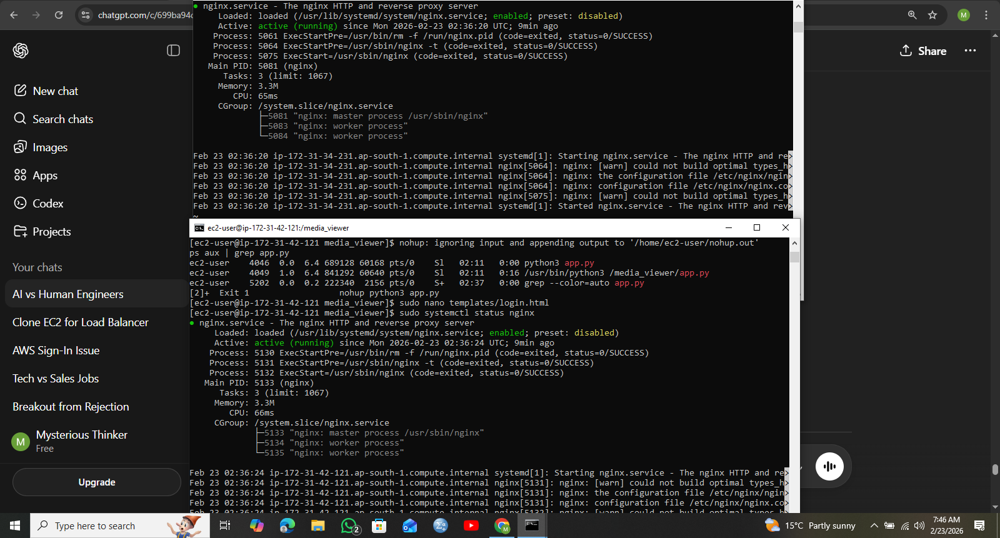
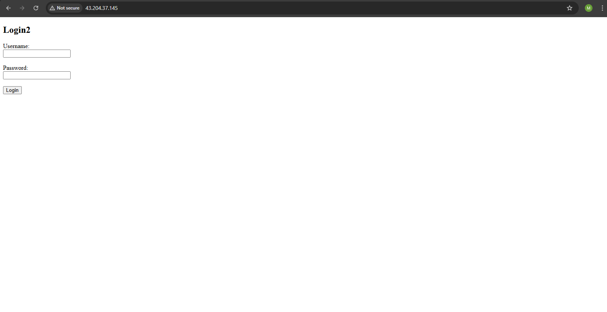
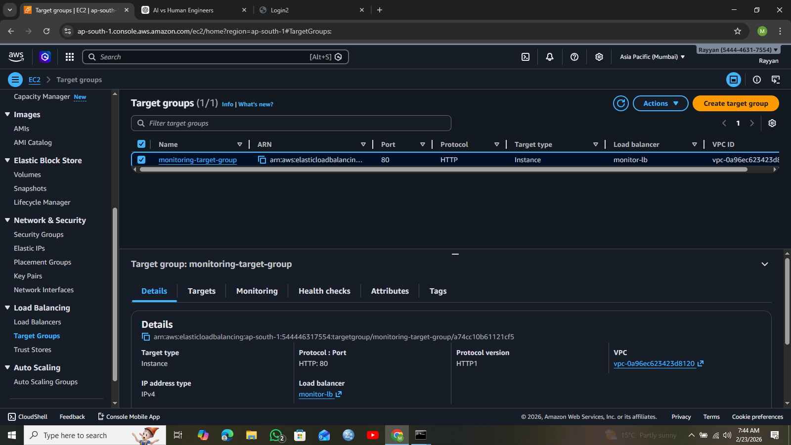
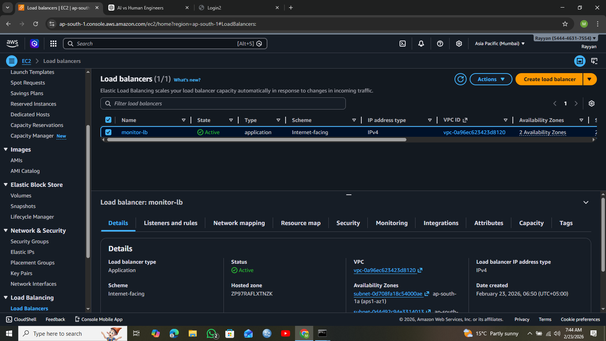
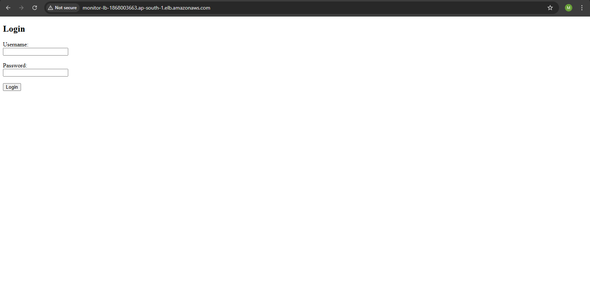
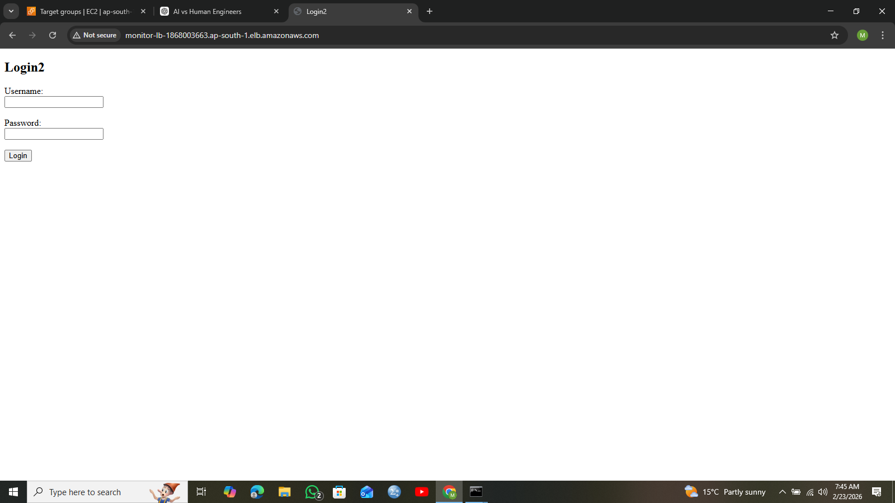

# AWS Load Balanced Media Viewer Deployment

## Project Overview

This project demonstrates deployment of a Flask-based Media Viewer web application on Amazon Web Services (AWS) using multiple EC2 instances behind an Application Load Balancer.

The goal of this project is to achieve:

- High Availability
- Load Balancing
- Fault Tolerance
- Production-style deployment

If one instance fails, traffic is automatically routed to the other instance.

---

## Architecture

User → Application Load Balancer → EC2 Instance 1 → Nginx → Flask App (Port 5000)  
                                 → EC2 Instance 2 → Nginx → Flask App (Port 5000)

---

## AWS Services Used

- Amazon EC2
- Application Load Balancer
- Target Groups
- Elastic Block Store (EBS)
- Security Groups
- Amazon Linux

---

## Technologies Used

- Python
- Flask
- Nginx
- Linux
- AWS Cloud

---

## Step 1: Launch EC2 Instance

- Created EC2 instance using Amazon Linux
- Allowed ports:
  - 22 (SSH)
  - 80 (HTTP)

Screenshot:  


---

## Step 2: Install Required Software

Connected to EC2 via SSH and installed Nginx and Python:

```bash
sudo yum install python3 nginx -y
```

Started Nginx:

```bash
sudo systemctl start nginx
sudo systemctl enable nginx
```

---

## Step 3: Deploy Flask Application

Uploaded media viewer application and started it:

```bash
nohup python3 app.py &
```

Application runs on:

```
http://127.0.0.1:5000
```

---

## Step 4: Configure Nginx Reverse Proxy

Edited config file:

```bash
sudo nano /etc/nginx/conf.d/default.conf
```

Added configuration:

```nginx
server {
    listen 80;
    server_name _;

    location / {
        proxy_pass http://127.0.0.1:5000;
        proxy_set_header Host $host;
        proxy_set_header X-Real-IP $remote_addr;
    }
}
```

Restarted nginx:

```bash
sudo systemctl restart nginx
```

Now application accessible via:

```
http://EC2-PUBLIC-IP
```

Screenshot:  


---

## Step 5: Create Second EC2 Instance

Created a clone EC2 instance with same setup to enable load balancing.

Screenshots:  


---

## Step 6: Create Target Group

- Created target group
- Registered both EC2 instances
- Verified health status as healthy

Screenshot:  


---

## Step 7: Create Application Load Balancer

- Created internet-facing load balancer
- Attached target group
- Enabled HTTP listener on port 80

Screenshot:  


---

## Step 8: Test Load Balancer

Accessed application using Load Balancer DNS:

```
http://load-balancer-dns-name
```

Traffic successfully distributed between instances.

Screenshot:  



---

## Key Features

- High availability architecture
- Load balancing across multiple servers
- Reverse proxy using nginx
- Fault tolerant deployment
- Production-ready setup

---

## How Load Balancing Works

Application Load Balancer automatically distributes incoming traffic between EC2 instances.

If one instance fails, traffic is redirected to healthy instance.

This ensures continuous uptime.

---

## Author

Rayyan Mudassar
AWS Cloud Engineering Project  
Media Viewer Load Balanced Deployment.
