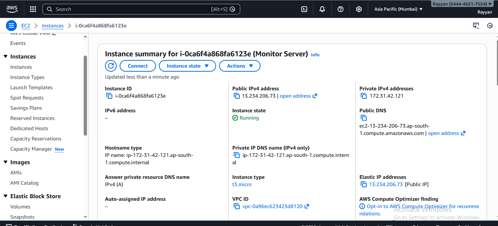
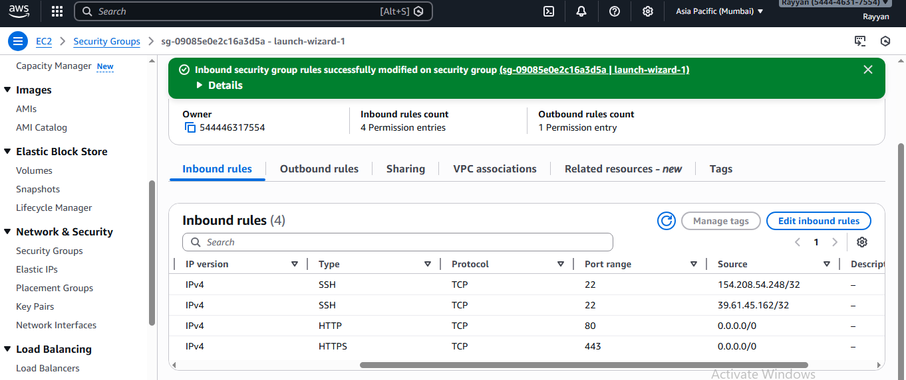
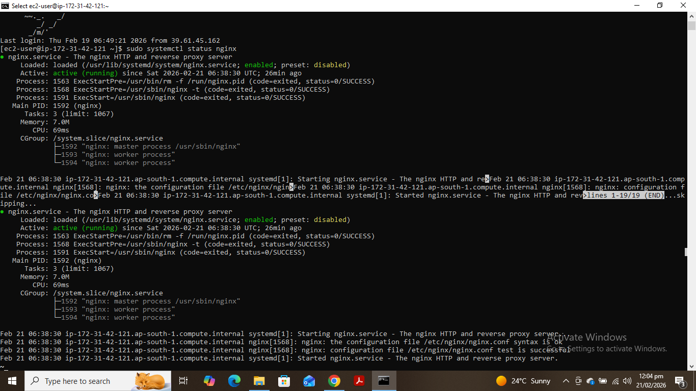
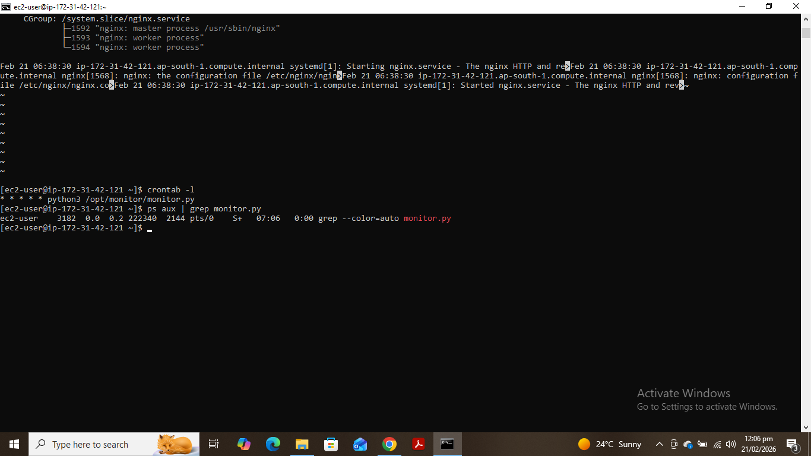
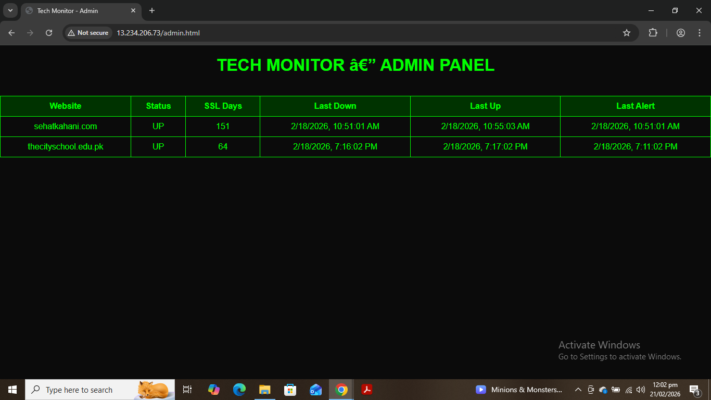
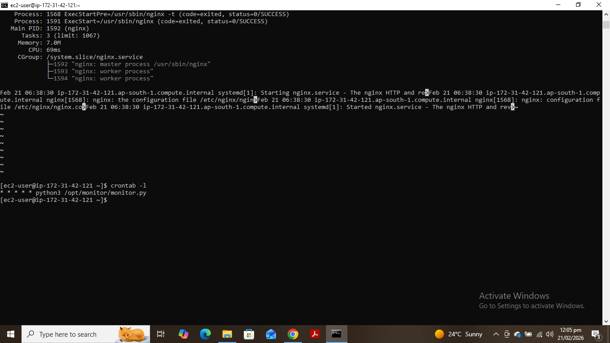

# AWS Website Monitoring SaaS (Real-Time Monitoring System)

A real-time website monitoring SaaS built using AWS EC2, Nginx, Python, and Cron Jobs. This system monitors website uptime, SSL certificate expiry, and availability, and displays results on a live dashboard and also sends email if the website is down or it's
SSL is expiring.

---

## Features

- Real-time website uptime monitoring
- SSL certificate expiry monitoring
- Automated monitoring using cron jobs
- Live dashboard hosted on Nginx
- Can Run 24/7 on AWS EC2
- Lightweight and efficient
- Security-first design
- Email Alerts

---

## Architecture

User → Nginx Web Server → Dashboard (HTML)

Cron Job → Python Monitoring Script → Checks Websites → Updates status.json → Dashboard Displays Results

```
            Internet
               │
               ▼
           AWS EC2
       ┌─────────────┐
       │   Nginx     │
       │ Dashboard   │
       └──────┬──────┘
              │
              ▼
       status.json file
              ▲
              │
        Python Script
              ▲
              │
          Cron Job
              │
              ▼
     External Websites
```
---

## Technologies Used

- AWS EC2 (Cloud Infrastructure)
- Nginx (Web Server)
- Python (Monitoring Script)
- Linux (Amazon Linux)
- Cron Jobs (Automation)
- JSON (Data storage)
- HTML/CSS (Dashboard UI)

---

## AWS Services Used

- EC2 (Compute)
- Security Groups (Firewall)
- Elastic IP (Static IP)

---

## Screenshots

### EC2 Instance Running



### Security Group



### Nginx Status



### Script Running



### Monitoring Dashboard



### Cron Job



---

## How It Works

1. Python script checks website status every minute
2. Script verifies:
   - HTTP response
   - Website uptime
   - SSL certificate expiry
3. Results stored in status.json
4. Nginx serves dashboard
5. Dashboard reads JSON and displays status

---

## Installation Steps

### Launch EC2

Launch Amazon Linux EC2 instance

### Install dependencies

```bash
sudo yum update -y
sudo yum install nginx python3 -y
```

### Start Nginx

```bash
sudo systemctl start nginx
sudo systemctl enable nginx
```

### Setup Cronjob

```bash
* * * * * python3 /opt/monitor/monitor.py
```

### Security Considerations
-Firewall rules configured via Security Groups
-SSH access restricted
-Runs on secure Linux environment
-Minimal attack surface

## Author

### Rayyan Mudassar
#### Cloud Architect and Security Engineer
#### Note: Python Scripts are generated with the help of AI. The main purpose of this project is to understand the real production systems
