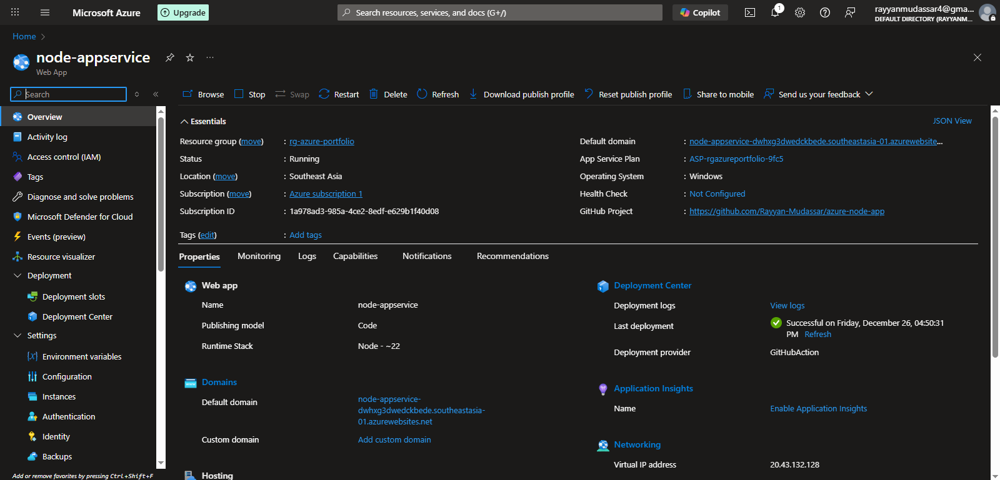
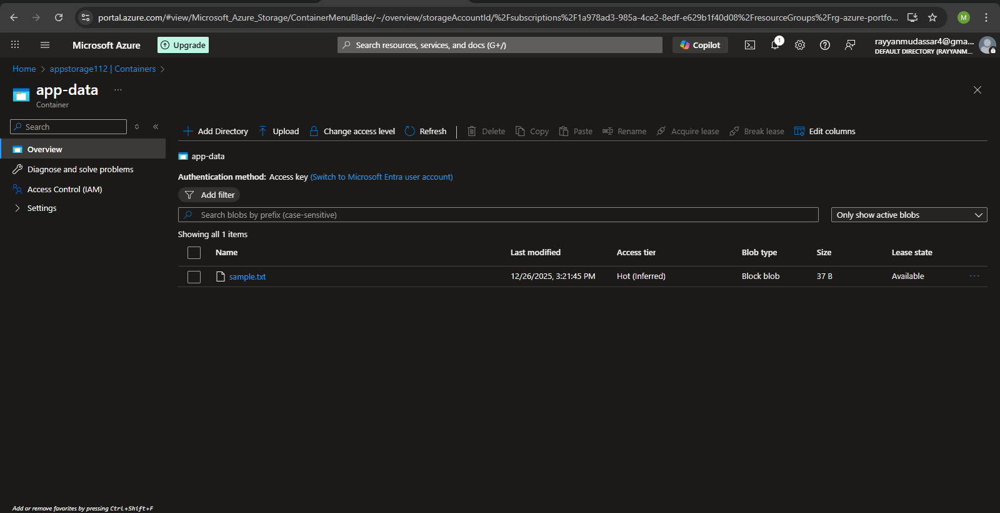
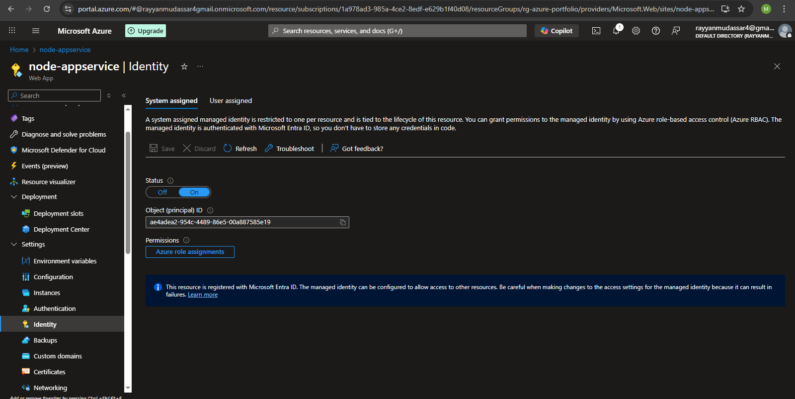
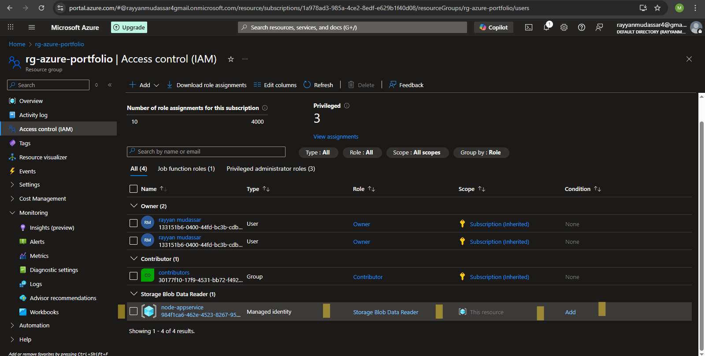
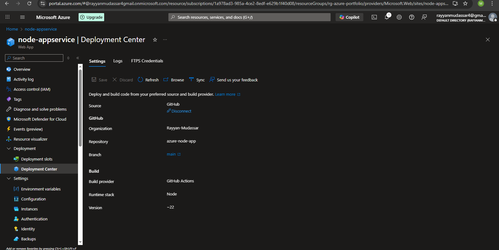
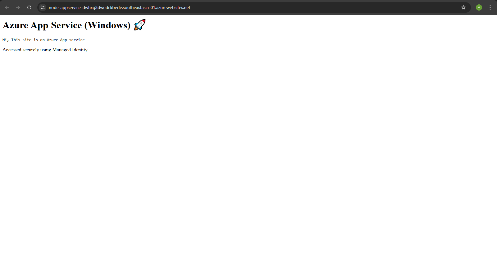

# Azure Node.js App with Managed Identity (Windows App Service)

## Overview
This project demonstrates deploying a **Node.js 22** application on **Azure App Service (Windows)** and securely accessing **Azure Blob Storage** using **Managed Identity and RBAC**, without using storage account keys or secrets.

The application reads a text file from Azure Blob Storage and displays its content through a web interface.

---

## Technologies Used
- Azure App Service (Windows)
- Node.js 22
- Azure Blob Storage
- Managed Identity (System Assigned)
- Azure RBAC
- GitHub
- Azure Deployment Center (GitHub Integration)

---

## Implementation Steps

### 1. Azure App Service
- Created an **Azure App Service (Windows)**.
- Selected **Node.js 22** as the runtime.
- Used Windows App Service to host the Node.js application.

### 2. Azure Storage
- Created an **Azure Storage Account**.
- Created a **Blob container**.
- Uploaded a sample file `sample.txt` to the container.

### 3. Managed Identity
- Enabled **System Assigned Managed Identity** on the App Service.
- No secrets, connection strings, or keys were stored in the application.

### 4. RBAC Configuration
- Assigned the **Storage Blob Data Reader** role to the App Service managed identity.
- This allows the application to read `sample.txt` from Blob Storage using identity-based access.

### 5. GitHub Integration & Deployment
- Pushed application code to **GitHub**.
- Integrated **Azure App Service with GitHub** using Deployment Center.

- Azure automatically created a GitHub Actions workflow.
- The Node.js application was deployed automatically on push.

---

## Security Design
- Uses **Managed Identity** instead of storage account keys.
- No credentials are stored in code or configuration files.
- Access to Blob Storage is controlled using **Azure RBAC**.
- Applied **least privilege** by granting read-only access to the application.

---

## Key Challenges & Solutions

### 403 Error on Windows App Service
- Issue: App showed “You do not have permission to view this directory”.
- Solution: Added a `web.config` file required for Node.js apps running on **Windows App Service (IIS)**.

### Secure Storage Access
- Implemented Managed Identity instead of connection strings.
- Verified access by removing RBAC role and observing application failure.

---

## How the Application Works
1. User accesses the application URL.
2. Azure App Service runs the Node.js app using IIS.
3. The app authenticates to Azure Blob Storage using Managed Identity.
4. The app reads `sample.txt` from the blob container.
5. The content is displayed in the browser.

---
