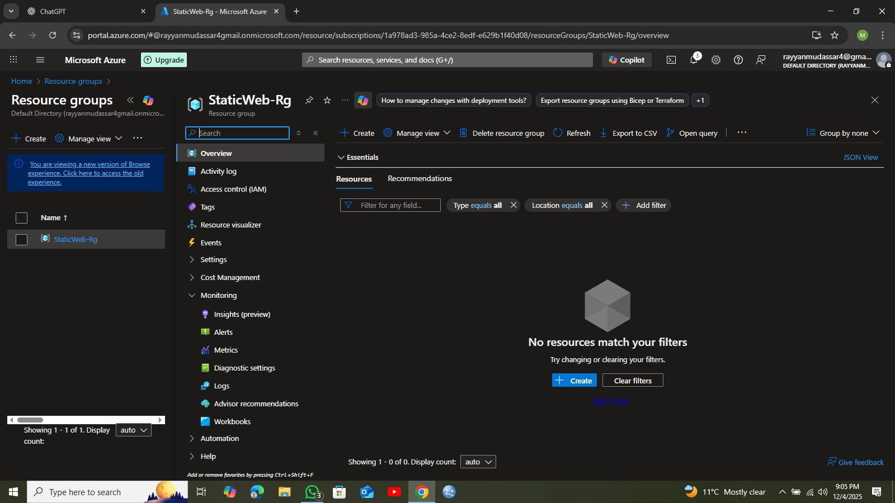
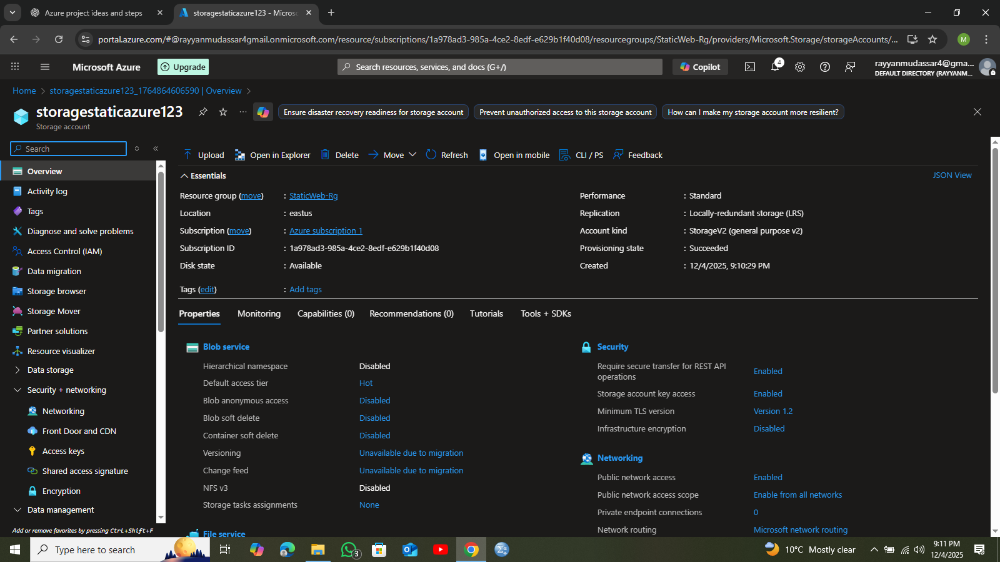
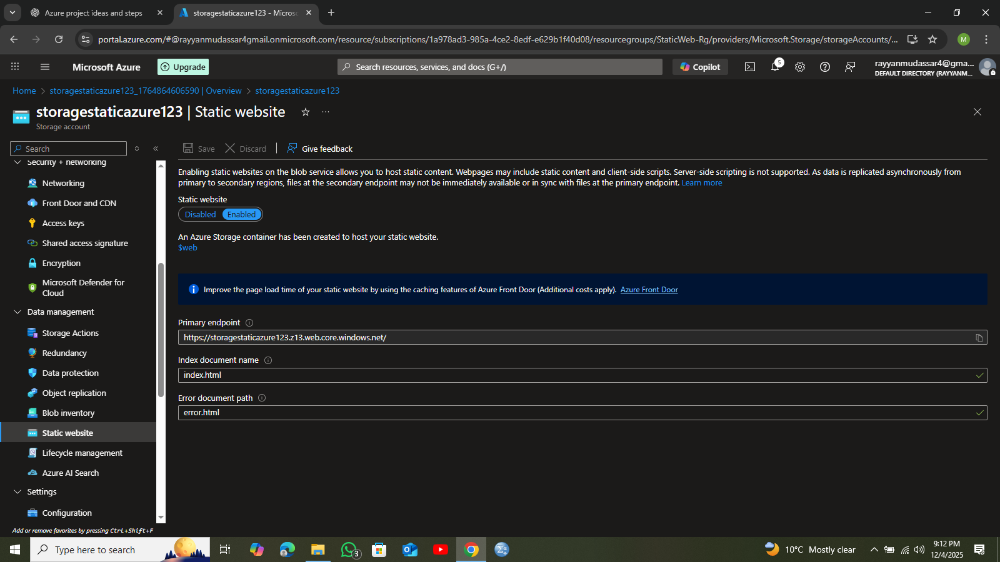
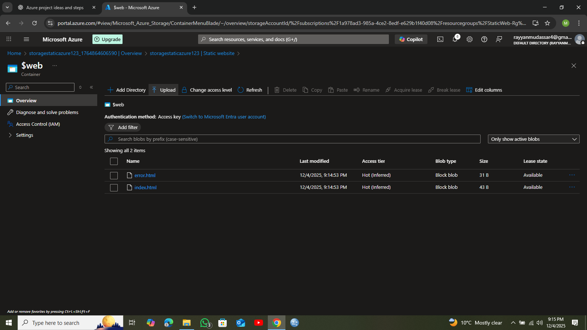
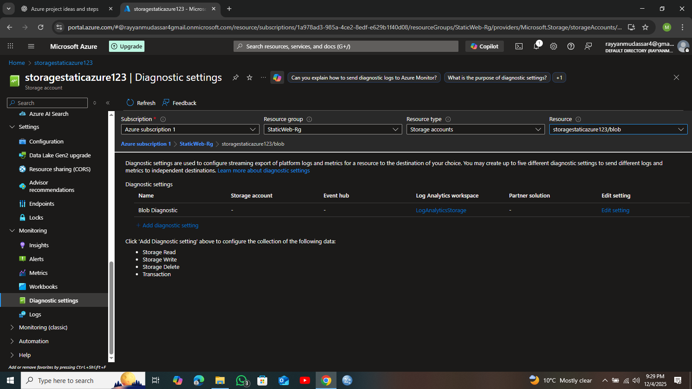
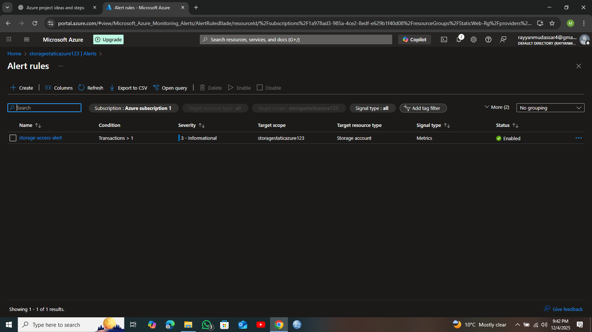
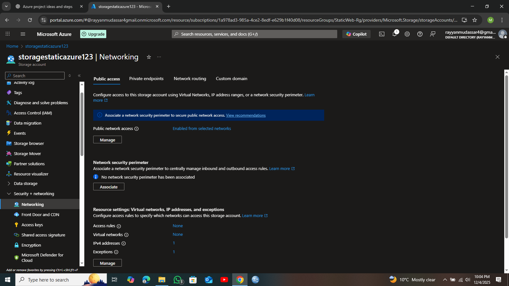
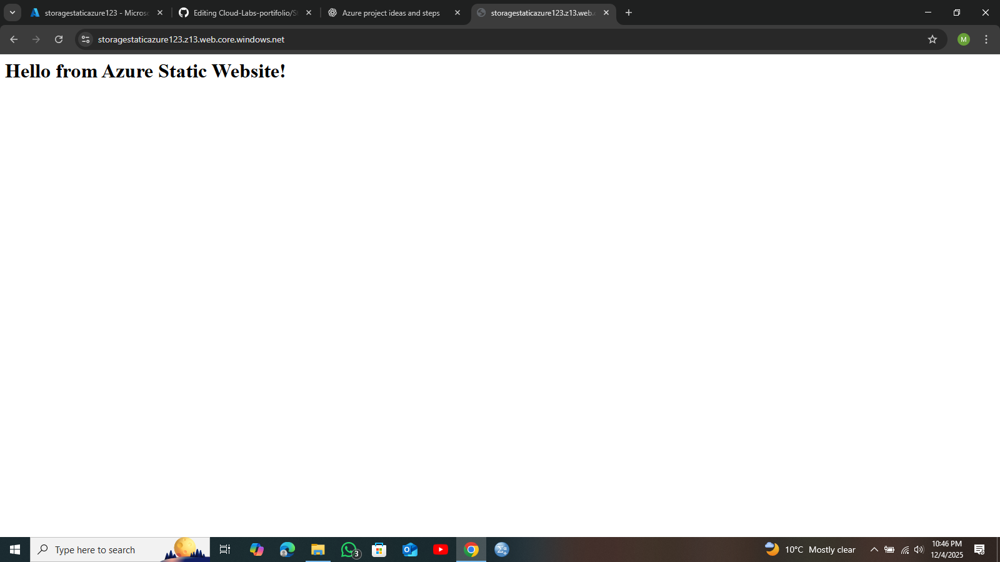

# Static Website Hosting on Azure Storage  
A complete end-to-end cloud project implementing static website hosting with security, monitoring, logging, and alerting — following real AZ-104 administration standards.

---

##  Project Overview
This project demonstrates how to host a static website on **Azure Storage Account**, along with implementing:

- Static Website Hosting  
- Monitoring through Log Analytics  
- Diagnostic logs  
- Alerts using Azure Monitor  
- Data protection & soft delete  
- Network restrictions  

---

##  Architecture Diagram (Conceptual)
- Resource Group  
- Storage Account (LRS)  
- `$web` container for website files  
- Log Analytics Workspace  
- Diagnostic Settings → Workspace  
- Azure Monitor Alert  
- Network restrictions  

---

#  **1. Created a Resource Group**
I created a Resource Group named **StaticWebsite-RG** to organize and manage all resources belonging to this project.

**Why this matters:**  
- Logical grouping of resources  
- Easier management and cleanup  
- Cost tracking per project  

 

---

#  **2. Created a Storage Account**
Created a Storage Account named **storagestaticazure123** using **Locally Redundant Storage (LRS)**.

**Why this matters:**  
- Storage Account is required to host static website files  
- LRS is low-cost and perfect for demo environments  

  

---

#  **3. Enabled Static Website Hosting**
Enabled the Static Website feature inside the Storage Account.  
Azure automatically created a special container named **$web**.

**Why this matters:**  
- `$web` container publicly serves HTML files  
- Allows hosting websites without needing a server  

 

---

#  **4. Uploaded Website Files**
Uploaded `index.html` and `error.html` into the `$web` container.

**Why this matters:**  
- These files are served as the website frontend  
- Index is the main page, 404 is fallback page  

 

---

#  **5. Configured Data Protection**
Enabled:
- Soft delete for blobs  
- Soft delete for containers  
- Blob versioning  

**Why this matters:**  
- Protects against accidental deletion  
- Ensures version history is available  
- Standard best practice for Storage Accounts  

 

---

#  **6. Enabled Diagnostic Settings**
Enabled diagnostic logs for:
- Blob Read operations  
- Blob Write operations  
- Blob Delete operations  
- StorageRead, StorageWrite, StorageDelete  

Logs were sent to the **Log Analytics Workspace**.

**Why this matters:**
- Tracks website access  
- Helps security and troubleshooting  
- Enables alerting based on logs/metrics  

 

---

#  **7. Created Alert Rule**
Configured an alert so I receive a notification whenever my website is accessed.

**Configuration:**  
- Signal: `Transactions`  
- Condition: Greater than `1`  
- Severity: Informational (Sev 3)  
- Action Group: Email notification  

**Why this matters:**  
- Real-time monitoring  
- Detect unusual access  
- Demonstrates Azure Monitor knowledge
 
 

---

#  **9. Configured Networking (IP Restrictions)**
Restricted Storage Account access to **Selected networks** and added my own public IP.

**Why this matters:**  
- Increases security  
- Prevents unauthorized access  
- Best practice for high-security workloads  

 
---

#  Final Output
The website is fully functional and accessible via the **Primary Endpoint URL** provided by Azure.

 
---

#  Cleanup
All resources can be deleted instantly by deleting the **Resource Group**, preventing any future cost.

---

#  What I Learned
- Azure Storage Account hosting  
- Static website hosting  
- Diagnostic settings & logs  
- Log Analytics  
- Data protection management  
- Alerts & monitoring  
- Networking 

---

